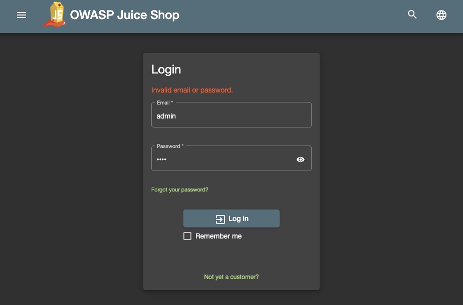

# Microgateway Demo: Juiceshop

This repository contains and describes an example setup of the OWASP Juice-Shop as a vulnerable backend that can be protected using the Web Application and API Protection Solution Airlock Microgateway.

## Setup Overview

To deploy this example, you need a K8s cluster of your choice.

To test the deployment and configuration, you can use a browser or curl from a command line.

Alternatively, we provide commands that spawn a pod to execute curl requests from within the cluster, if you want to test with solely cluster internal traffic.

### Deploy Airlock Microgateway 
See Quick start guide [below](#quick-start-guide---microgateway-operator).

### Vulnerable Web App: Juice Shop Deployment

The example creates:
- a Deployment with the image from https://hub.docker.com/r/bkimminich/juice-shop
- a NodePort Service for that deployment listening to NodePort 30080

```bash
kubectl apply -k juice-shop/
```

**Attack the juice shop to verify vulnerabilty.**
- Verify that a normal login fails. You can follow the [section on normal login](#failed-normal-login) for that.
- Use the SQL Injection vulnerability to gain access, as suggested in the [section on the attack payload](#attack-string-login).

Screen recording "Attack the unprotected Juice Shop":

https://github.com/airlock/microgateway-juiceshop/assets/143166124/deb49107-0e89-4fe5-a4fd-9ec47dbc3da4

### Protect Web App: Airlock Microgateway Configuration

Apply the Airlock Microgateway configuration custom resources for the Juice Shop deployment.

The configuration includes the following resources:
- [SidecarGateway](https://docs.airlock.com/microgateway/4.4/#data/1661841842553.html) :  Link between the protected application and Airlock Microgateway
- [ContentSecurity](https://docs.airlock.com/microgateway/4.4/#data/1659430054462.html) : Specifies the options to secure an upstream web application with a Microgateway Engine container
- [DenyRules](https://docs.airlock.com/microgateway/4.4/#data/1667549240920.html) : Block malicious requests to upstream web applications
- [HeaderRewrites](https://docs.airlock.com/microgateway/4.4/#data/1668421866216.html) : Header filtering/rewriting

```bash
kubectl apply -k microgateway-configuration/
```

Add the label `sidecar.microgateway.airlock.com/inject=true` to the Juice Shop deployment so that the previously deployed Airlock Microgateway Operator injects a Microgateway Engine sidecar.

```bash
kubectl patch deployment juice-shop -p '{"spec": {"template": {"metadata": {"labels": {"sidecar.microgateway.airlock.com/inject":"true"}}}}}' -n=juice-shop
```

Wait until the deployment juice-shop is rolled out with the Microgateway Sidecar injected.

```bash
kubectl rollout status deployment juice-shop -n=juice-shop
```

> **Note**: The patch command is used for demonstration purposes. It is recommended to add this label to the deployment resource file when managing applications on production.

**Attack the juice shop to verify protection.**
- You can retry the SQL Injection vulnerability suggested in the [section on the attack payload](#attack-string-login) and should now receive a Request Blocked message.

Screen recording "Attack the protected Juice Shop":

https://github.com/airlock/microgateway-juiceshop/assets/143166124/6fddbcd9-7059-4ef8-b93d-d5b72d103924

### Web app attack: SQL Injection Example
#### Failed normal login

Trying to login as user *admin* with any password results in an "Invalid email or password" error.

<details open>
<summary>Option A: Browser</summary>

Access the Juice Shop in a browser and navigate to Account > Login at the top right.

Try logging in as *admin* with any password.


</details>

<details>
<summary>Option B: Using curl directly</summary>

```bash
curl '<hostname>:<port>/rest/user/login' \
  -H 'Content-Type: application/json' \
  --data-raw $'{"email":"admin","password":"test"}'
```
</details>

<details>
<summary>Option C: Using dedicated pod</summary>

```bash
kubectl run -n=juice-shop -it --restart=Never --rm curl --image=curlimages/curl -- curl -v juice-shop:3000/rest/user/login -H 'Content-Type: application/json' --data-raw $'{"email":"admin","password":"test"}'
```
</details>

#### Attack string login

A login as *admin* into an unprotected Juice Shop is possible via SQL Injection. The following attack string can be used as a username with any password to access the application as the *admin* user.

```bash
admin' or 1=1 --
```

Without any additional protection in place, this will result in a successful login.
After protecting the Juice Shop with the Airlock Microgateway, the same attack will be blocked with "Request blocked: " followed by a UUID.

> **Hint**: Do not forget to logout for subsequent tests, if you were successful.

<details open>
<summary>Option A: Browser</summary>

Access the Juice Shop in a browser and navigate to Account > Login at the top right.

Try logging in with username `admin' or 1=1 --` and any password.


</details>

<details>
<summary>Option B: Using curl directly</summary>

```bash
curl '<hostname>:<port>/rest/user/login' \
  -H 'Content-Type: application/json' \
  --data-raw $'{"email":"admin\' or 1=1--","password":"test"}'
```
</details>

<details>
<summary>Option C: Using curl pod</summary>

```bash
kubectl run -n=juice-shop -it --restart=Never --rm curl --image=curlimages/curl -- curl -v juice-shop:3000/rest/user/login -H 'Content-Type: application/json' --data-raw $'{"email":"admin\' or 1=1--","password":"test"}'
```
</details>


## Documentation and links

Check the official documentation at **[docs.airlock.com](https://docs.airlock.com/microgateway/latest/)** or the product website at **[airlock.com/microgateway](https://www.airlock.com/en/microgateway)**. The links below point out the most interesting documentation sites when starting with Airlock Microgateway.

* [Getting Started](https://docs.airlock.com/microgateway/latest/#data/1660804708742.html)
* [System Architecture](https://docs.airlock.com/microgateway/latest/#data/1660804709650.html)
* [Installation](https://docs.airlock.com/microgateway/latest/#data/1726159368039.html)
* [Troubleshooting](https://docs.airlock.com/microgateway/latest/#data/1659430054787.html)
* [Release Repository](https://github.com/airlock/microgateway)

# Quick start guide - Microgateway Operator

<details>
<summary>Expand for Details</summary>

The instructions below provide a quick start guide for a "standard" Kubernetes setup. Setup description for, e.g., OpenShift, as well as detailed information are provided in the **[manual](https://docs.airlock.com/microgateway/latest/)**.
> **Note**: Installing Airlock Microgateway CNI is required for this example. The example configuration is meant for the sidecar data plane mode.
> 
> See [documentation](https://docs.airlock.com/microgateway/4.4/#data/1660804709650.html) for more information about data plane modes.

## Prerequisites
* [Airlock Microgateway License](#obtain-airlock-microgateway-license)
* [cert-manager](https://cert-manager.io/)
* [helm](https://helm.sh/docs/intro/install/) (>= v3.8.0)

In order to use Airlock Microgateway you need a license and the cert-manager. You may either request a community license free of charge or purchase a premium license.
For an easy start in non-production environments, you may deploy the same cert-manager we are using internally for testing.
### Obtain Airlock Microgateway License
1. Either request a community or premium license
   * Community license: [airlock.com/microgateway-community](https://airlock.com/en/microgateway-community)
   * Premium license: [airlock.com/microgateway-premium](https://airlock.com/en/microgateway-premium)
2. Check your inbox and save the license file microgateway-license.txt locally.

> See [Community vs. Premium editions in detail](https://docs.airlock.com/microgateway/latest/#data/1675772882054.html) to choose the right license type.
### Deploy cert-manager
```bash
# Install cert-manager
kubectl apply -k https://github.com/airlock/microgateway/examples/utilities/cert-manager/?ref=4.4.1

# Wait for the cert-manager to be up and running
kubectl -n cert-manager wait --for=condition=ready --timeout=600s pod -l app.kubernetes.io/instance=cert-manager
```

## Deploy Airlock Microgateway CNI
> **Note**: Certain environments such as OpenShift or GKE require non-default configurations when installing the CNI plugin. Please refer to the [Release Readme](https://github.com/airlock/microgateway/) or the Chapter on [Sidecar-based Microgateway installation in docs.airlock.com](https://docs.airlock.com/microgateway/4.4/#data/1726159368039.html)
1. Install the CNI Plugin with Helm.
   ```bash
   # Standard setup
   helm install airlock-microgateway-cni -n kube-system oci://quay.io/airlockcharts/microgateway-cni --version '4.4.1'
   kubectl -n kube-system rollout status daemonset -l app.kubernetes.io/instance=airlock-microgateway-cni
   ```
2. (Recommended) You can verify the correctness of the installation with `helm test`.
   ```bash
   # Standard setup
   helm upgrade airlock-microgateway-cni -n kube-system --set tests.enabled=true --reuse-values oci://quay.io/airlockcharts/microgateway-cni --version '4.4.1'
   helm test airlock-microgateway-cni -n kube-system --logs
   helm upgrade airlock-microgateway-cni -n kube-system --set tests.enabled=false --reuse-values oci://quay.io/airlockcharts/microgateway-cni --version '4.4.1'
   ```

   Consult our [documentation](https://docs.airlock.com/microgateway/4.4/#data/1659430054787.html) in case of any installation error.
## Deploy Airlock Microgateway Operator

> This guide assumes a microgateway-license.txt file is present in the working directory.

1. Install CRDs and Operator.
   ```bash
   # Create namespace
   kubectl create namespace airlock-microgateway-system

   # Install License
   kubectl -n airlock-microgateway-system create secret generic airlock-microgateway-license --from-file=microgateway-license.txt

   # Install Operator (CRDs are included via the standard Helm 3 mechanism, i.e. Helm will handle initial installation but not upgrades)
   helm install airlock-microgateway -n airlock-microgateway-system oci://quay.io/airlockcharts/microgateway --version '4.4.1' --wait
   ```

2. (Recommended) You can verify the correctness of the installation with `helm test`.
   ```bash
   helm upgrade airlock-microgateway -n airlock-microgateway-system --set tests.enabled=true --reuse-values oci://quay.io/airlockcharts/microgateway --version '4.4.1'
   helm test airlock-microgateway -n airlock-microgateway-system --logs
   helm upgrade airlock-microgateway -n airlock-microgateway-system --set tests.enabled=false --reuse-values oci://quay.io/airlockcharts/microgateway --version '4.4.1'
   ```

## License
View the [detailed license terms](https://www.airlock.com/en/airlock-license) for the software contained in this image.
* Decompiling or reverse engineering is not permitted.
* Using any of the deny rules or parts of these filter patterns outside of the image is not permitted.

</details>
<br>

Airlock<sup>&#174;</sup> is a security innovation by [ergon](https://www.ergon.ch/en)

<!-- Airlock SAH Logo (different image for light/dark mode) -->
<a href="https://www.airlock.com/en/secure-access-hub/">
<picture>
    <source media="(prefers-color-scheme: dark)"
        srcset="https://raw.githubusercontent.com/airlock/microgateway/main/media/Airlock_Logo_Negative.png">
    <source media="(prefers-color-scheme: light)"
        srcset="https://raw.githubusercontent.com/airlock/microgateway/main/media/Airlock_Logo.png">
    
</picture>
</a>
